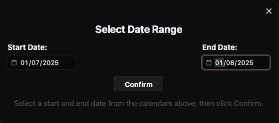
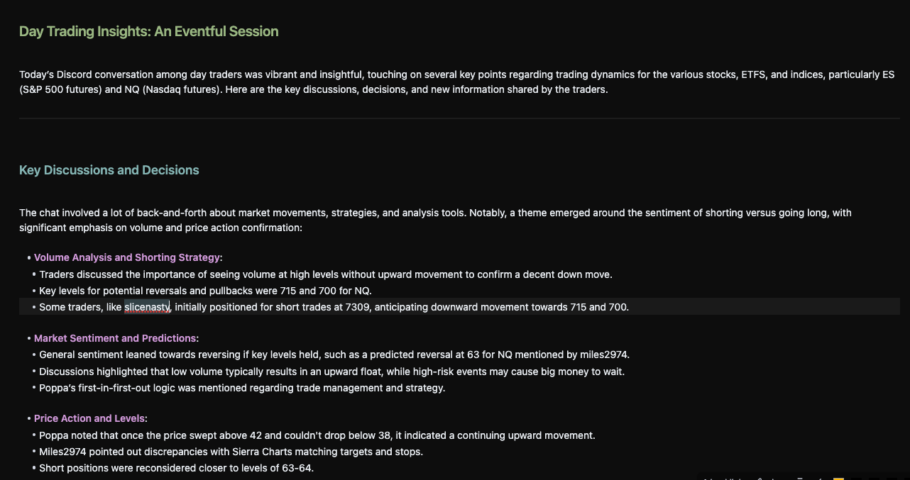

# Discord Summarizer

This simple plugin allows you to summarize up to 7 days worth of conversation from a given Discord Channel for a given time frame.  The resulting summary will be written to the active note.

## Usage

1. Click the Ribbon icon or use the Obsidian Command `Discord Summarizer: Get Summary of Discord Channel`.

2. Choose Start and End dates that define the window of messages you wish to summarize.

3. View the summary in your active note

## Settings

 - **Discord Channel ID**:
    - ID of the Discord Channel to Summarize
- **Discord Server ID**:
    - ID of the Discord Server containing the channel to summarize
- **Discord Token**:
    - Your Discord Auth Token
- **OpenAI Key**:
    - Your OpenAI Key  

## Future Enhancements

- [ ] More AI Provider Options
- [ ] Allow for summarization of multiple channels
- [ ] Dynamic querying of channels (rather than storing in static config)
- [ ] Additional output options (e.g. Saving to a new note rather than inline)
- [ ] UI progress indicator for backend work

## Support

